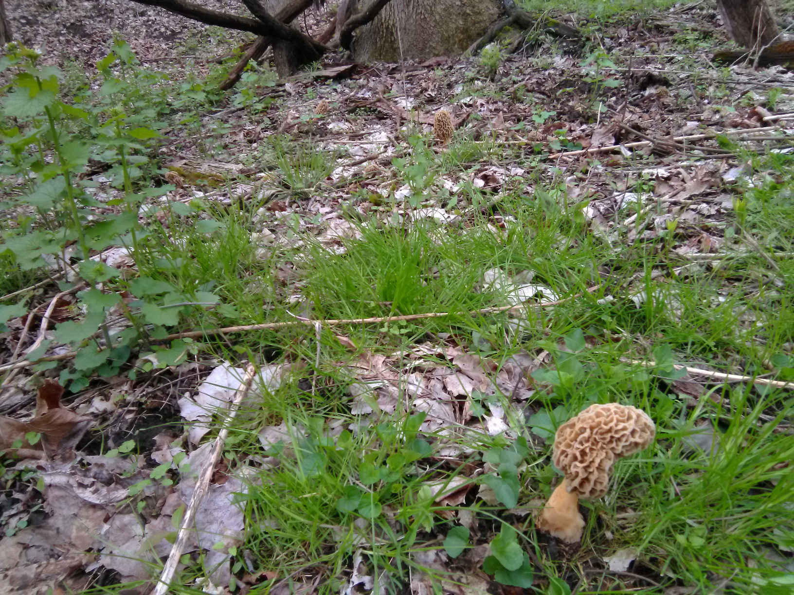

<br/>
Morchella Americana by Walt Sturgeon, see https://ohiomushroomsociety.wordpress.com/

# Virtual Morel Foraging with R

It's that time of year again when people in the Midwestern US go nuts for morel
mushrooms. Although fairly common in Western Pennsylvania, Ohio, Indiana,
Illinois, Wisconsin and, especially, Michigan[^locations], they can still be
tricky to find due to the vagaries of weather and mysteries of morel
reproduction.

Morels are indeed delicious mushrooms, but I really think a big part of their
appeal is their elusive nature. It's so exciting when you finally find some--or
even one!--after hours and hours of hiking in the woods.

For all of you not fortunate to be in the Midwest in the spring, here is a
not-so-serious note on virtual morel foraging.  But really, this note explores
ways you can mine image data from the internet using a cornucopia of data
science software tools orchestrated by R.

The note proceeds as follows:

1. Virtually hunt for images of morel mushrooms on the internet.
2. Inspect each image for GPS location data.
3. Map the results!

Now, I know what you're saying: most mushroom
hunters--especially morel hunters--are secretive
about their locations and will strip GPS information from their pictures.
And we will see that is exactly the case, only about 1% of the pictures
we find include GPS data.
But there are *lots* of pictures on the internet
so eventually even that 1% can be interesting to look at...


## The Hunt

Our virtual mushroom foray begins as any real-world foray does, looking around
for mushrooms! But instead of a forest, we'll use the internet. In particular,
Let's ask popular search engines to search for images of morels, and then
inspect those images for GPS coordinates. As you can imagine, most morel
hunters are secretive about their foraging and strip GPS coordinates from their
images...

But how can we ask internet search engines to return image information directly
to R?  Unfortunately, the main image search engines like Google and Bing today
rely on interactive JavaScript operation--precluding simple use of, say, R's
excellent curl package.  Fortunately, there exists a tool for
*web browser automation* called Selenium
(https://docs.seleniumhq.org/) and, of course, a corresponding
R interface package called RSelenium
(https://cran.r-project.org/package=RSelenium).
RSelenium essentially allows R to use a web browser like a human, including
clicking on buttons, etc. Using web browser automation is not ideal because
we rely on fragile front-end web page/JavaScript interfaces that can change
at any time instead of something well-organized like HTML, but we
seem to be forced into this approach by the modern internet.

Our hunt requires that the Google chrome browser is installed on your
system[^google], and of course R! You'll need at least the following
R packages installed. If you don't have them, install them from CRAN:
```{r}
library(wdman)
library(RSelenium)
library(jsonlite)
library(leaflet)
library(parallel)
library(htmltools)
```

Let's define two functions, one to search Microsoft Bing images and another
to search Google images. Each function takes an RSelenium browser and
a search term as input, and returns a list of search result URLs.
```{r}
bing = function(wb, search_term)
{
  url = sprintf("https://www.bing.com/images/search?q=%s&FORM=HDRSC2", search_term)
  wb$navigate(url)
  invisible(replicate(200, wb$executeScript("window.scrollBy(0, 10000)"))) # infinite scroll down to load more results...
  x = wb$findElements(using="class name", value="btn_seemore") # more results...
  if(length(x) > 0) x[[1]]$click()
  invisible(replicate(200, wb$executeScript("window.scrollBy(0, 10000)")))
  Map(function(x)
  {
    y = x$getElementAttribute("innerHTML")
    y = gsub(".* m=\\\"", "", y)
    y = gsub("\\\".*", "", y)
    y = gsub("&quot;", "\\\"", y)
    y = gsub("&amp;", "&", y)
    fromJSON(y)[c("purl", "murl")]
  }, wb$findElements(using = "class name", value = "imgpt"))
}

google = function(wb, search_term)
{
  url = sprintf("https://www.google.com/search?q=%s&source=lnms&tbm=isch", search_term)
  wb$navigate(url)
  invisible(replicate(400, wb$executeScript("window.scrollBy(0, 10000)")))
  Map(function(x)
  {
    ans = fromJSON(x$getElementAttribute("innerHTML")[[1]])[c("isu", "ou")]
    names(ans) = c("purl", "murl") # comply with bing (cf.)
    ans
  }, wb$findElements(using = "xpath", value = '//div[contains(@class,"rg_meta")]'))
}
```

These functions emulate what a human would do by scrolling down to get more
image results (both web sites us an 'infinite scroll' paradigm), and in the
Bing case clicking a button. This is what I meant above when I said that this
approach is fragile and not optimal--it's quite possible that some small change
in either search engine in the future will cause the above functions to not
work.

Let's finally run our virtual mushroom hunt! We set up a Google chrome-based
RSelenium web browser interface and run some searches:
```{r, eval=FALSE}
eCaps = list(chromeOptions = list( args = c('--headless', '--disable-gpu', '--window-size=1280,800')))
cr = chrome(port = 4444L)
wb = remoteDriver(browserName = "chrome", port = 4444L, extraCapabilities = eCaps)
wb$open()
foray = c(google(wb, "morels"),
          google(wb, "indiana morel"),
          google(wb, "michigan morel"),
          google(wb, "oregon morel"),
          bing(wb, "morels"),
          bing(wb, "morel mushrooms"),
          bing(wb, "michigan morels"))
wb$close()
```
Feel free to try out different search terms. The result is a big list of possible
image URLs that just might contain pictures of morels with their coordinates.
This particular foray result above, run in late April, 2019 returned about
2000 results.


## Identification

Next, we scan every result for GPS coordinates using the nifty external
command-line tool called exiftool (https://www.sno.phy.queensu.ca/~phil/exiftool/)
and the venerable curl program (https://curl.haxx.se/download.html).
If you don't have those tools, you'll need to install them on your computer.
They are available for most major operating systems. On Debian flavors of GNU/Linux
like Ubuntu it's really easy, just run:

```{bash, eval=FALSE}
sudo apt-get install exiftool curl
```

Once the curl and exiftool programs are installed we can invoke them for each
image URL result from R to efficiently scan through part of the image for GPS
coordinates using these functions:
```{r}
#' Extract exif image data
#' @param url HTTP image URL
#' @return vector of exif character data or NA
exif = function(url)
{
  tryCatch({
    cmd = sprintf("curl --max-time 5 --connect-timeout 2 -s \"%s\" | exiftool -fast2 -", url)
    system(cmd, intern=TRUE)
  }, error = function(e) NA)
}

#' Convert an exif GPS character string into decimal latitude and longitude coordinates
#' @param x an exif GPS string
#' @return a named numeric vector of lat/lon coordinates or NA
decimal_degrees = function(x)
{
  s = strsplit(strsplit(x, ":")[[1]][2], ",")[[1]]
  ans = Map(function(y)
            ifelse(y[4] == "S" || y[4] == "W", -1, 1) *
              (as.integer(y[1]) + as.numeric(y[2])/60 + as.numeric(y[3])/3600),
          strsplit(gsub(" +", " ", gsub("^ +", "", gsub("deg|'|\"", " ", s))), " "))
  names(ans) = c("lat", "lon")
  ans
}

#' Evaluate a picture and return GPS info if available
#' @param url image URL
#' @return a list with pic, date, month, label, lat, lon entries or NULL
forage = function(url)
{
  ex = exif(url)
  i = grep("GPS Position", ex)
  if(length(i) == 0) return(NULL)
  pos = decimal_degrees(ex[i])
  date = tryCatch(strsplit(ex[grep("Create Date", ex)], ": ")[[1]][2], error=function(e) NA)
  month = ifelse(is.na(date), NA, as.numeric(strftime(strptime(date, "%Y:%m:%d %H:%M:%S"), format="%m")))
  label = paste(date, "  source: ", url)
  list(pic=paste0(""),
       date=date, month=month, label=label,
       lat=pos$lat, lon=pos$lon)
}
```

Now, there might be many search results to evaluate. Each evaluation is not
very compute intensive. And the results are independent of each other.  So why
not run this evaluation step in parallel? R makes this easy to do,
although with some differences between operating systems. The following works
well on Linux or Mac systems. It will also run fine on Windows systems, but
sequentially.

```{r, eval=FALSE}
options(mc.cores = detectCores() + 2) # overload cpu a bit
print(system.time({
bounty = do.call(function(...) rbind.data.frame(..., stringsAsFactors=FALSE),
  mcMap(function(x)
  {
    forage(x$murl)
  }, foray)
)
}))

# Omit zero-ed out lat/lon coordinates
bounty = bounty[round(bounty$lat) != 0 & round(bounty$lon != 0), ]
```

The above R code runs through every image result, returning those containing
GPS coordinates as observations in a data frame with image URL, date, month,
label, and decimal latitude and longitude variables.

Starting with over 2,000 image results, I ended up with about 20 pictures
with GPS coordinates. Morels are as elusive in the virtual world as the
real one!

Finally, let's plot each result colored by the month of the image on
a map using the superb R leaflet package. You can click on each point
to see its picture.

```{r, echo=FALSE}
load("bounty.rdata")
bounty = bounty[round(bounty$lat) != 0 & round(bounty$lon != 0), ]
```

```{r}
colors = c(January="#555555", February="#ffff00", March="#000000",
           April="#0000ff", May="#00aa00", June="#ff9900", July="#00ffff",
           August="#ff00ff", September="#55aa11", October="#aa9944",
           November="#77ffaa", December="#ccaa99")
clr = as.vector(colors[bounty$month])
map = addTiles(leaflet())
map = addCircleMarkers(map, data=bounty, lng=~lon, lat=~lat, fillOpacity=0.6,
         stroke=FALSE, fillColor=clr, label=~label, popup=~pic)
i = sort(unique(bounty$month))
map = addLegend(map, position="bottomright", colors=colors[i],
        labels=names(colors)[i], title="Month", opacity=1)
map
```
Click on the points to see their associated pictures...


## Closing Notes

You may have noticed that not all of the pictures are of morels! Indeed,
there are several group foray pictures, a picture of a deer, and several
pictures of false morel mushrooms!

What could be done about that? Well, if you are truly geeky and somewhat bored,
you could train a deep neural network to identify morels, and then feed these
results into that. Me, I prefer wasting my time wandering actual woods looking
for interesting mushrooms... It's also worth pointing out that the false morel
and morel habitats are often quite similar so those false morel sightings
spotted in the map above might actually be interesting places to forage!


[^locations]: To be sure, morels are found in many other places across the
US and the world. But I mostly forage in the Midwest and know it best.
[^google]: I tried first to use the phantomjs driver from R's wdman
package (https://cran.r-project.org/package=wdman) that doesn't require
an external web browser. But I could only get that to work for searching
Microsoft bing image results, not Google image search. Help or
advice on getting phantomjs to work would be appreciated!

